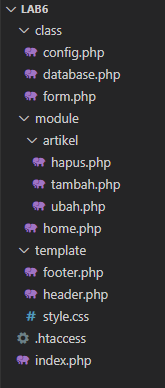
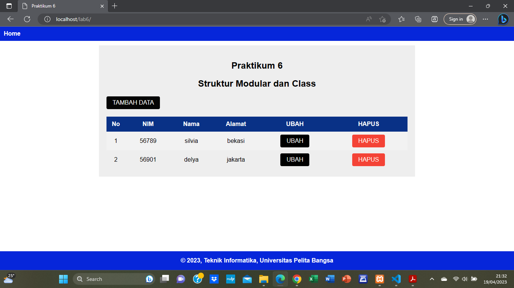

# Praktikum 6 - OOP Lanjutan

##  Tugas/Latihan

* Copy file library (class) dari praktikum 5 dan letakkan pada folder class.
* Buat file template yang berisi template dan css untuk header, footer dan menu sidebar.
* Buat modul artikel yang berisi CRUD dengan memanfaatkan library
database dan form tersebut.
* File index.php berisi proses routing aplikasi dan dikombinasikan
dengan penggunaan mod_rewrite pada file htaccess.

## Struktur Program

## Tampilan Program

## Terima kasih!